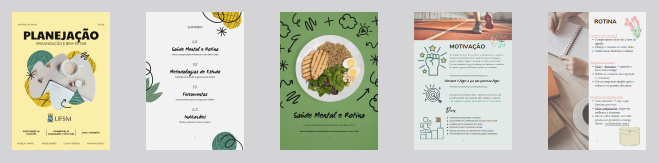
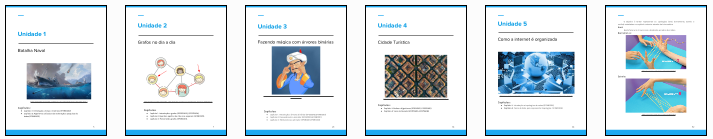

< <a href="..">Voltar</a> 

  <a href="http://www.ufsm.br/">Universidade Federal de Santa Maria</a> 
  
  <h3>Práticas Extensionistas na Educação em Computação</h2>
  
  

    Mais do que um requisito curricular: formação de excelência com impacto além da sala de aula!
         
  

  <h1 align="center">Resultados da turma 2025.1</h3>

## Grupo "Organização e Bem-Estar"

O grupo concebeu, planejou e realizou uma ação com público universitário, voltada para promoção do desenvolvimento pessoal e acadêmico.

Na concepção e planejamento, o grupo realizou reuniões com diferentes setores da UFSM (Setor de Apoio Pedagógico do CT,  Núcleo de Educação e Saúde da Coordenadoria de Ações Educacionais, Comunicação CT), dialogando com profissionais de diferentes áreas, validando e refinando a proposta.

Após divulgação e inscrições, foi realizado um encontro com o público, no dia 11/06, das 19h às 21h, com os seguintes momentos: 
- apresentação sobre desafios da vida universitária, pelo psicólogo Renato Favarin (CRP 07/13998), da CAED
- compartilhamento de dicas e ferramentas de organização pessoal para estruturar metas, administrar o tempo e reduzir a sobrecarga diária
- criação de grupo no WhatsApp: desafio de uma semana

A ação ofereceu um espaço acolhedor de troca de experiências, estimulando uma vida universitária mais equilibrada, produtiva e saudável.

Alguns registros e produções:
- [Fotos do encontro](https://drive.google.com/drive/folders/1vbptMloDz9RSY9mdYct3TfxLNYSTxlQz)
- [Slides](https://www.canva.com/design/DAGmxNJrfQs/iPmnevlYN-7iYO0RWrKr3g/view?utm_content=DAGmxNJrfQs&utm_campaign=designshare&utm_medium=link2&utm_source=uniquelinks&utlId=hdbbe38ce6c)
- [Material de apoio](planejacao/MaterialDeApoioPlanejAção-2025.pdf)
- Relatórios individuais:
    - [André Paulo Streck Renner](https://github.com/ufsm00759/extensao-2025a-r3nner/) 
    - [Laura Ferreira](https://github.com/ufsm00759/extensao-2025a-lauraferreira04)
    - [Mariana Ciervo Borges ](https://github.com/ufsm00759/extensao-2025a-MarianaCiervoB)

## Grupo "BNCC Computação"

A "BNCC Computação" é um complemento à Base Nacional Comum Curricular, voltado ao desenvolvimento de habilidades relacionadas à Computação na Educação Básica. Sua publicação é de 2022 e traz consigo muitos desafios. Em 2024, o município de Santa Maria passou a formalizar sua implantação no Ensino Fundamental, articulando instituições e profissionais de educação de diferentes níveis, rumo a este objetivo.

O grupo interagiu com a equipe do [Núcleo de Tecnologia Educacional Municipal](https://sites.google.com/edu.santamaria.rs.gov.br/ntem-computacao), vinculado à Secretaria de Município da Educação (SMEd) de Santa Maria, com a finalidade de pesquisar e adaptar atividades didáticas para ensino-aprendizagem do pensamento computacional, que é um dos eixos da BNCC Computação.

O grupo organizou dois momentos de interação com a equipe do NTEM, na sede do Núcleo. Nesses momentos, desenvolveram atividades abordando conceitos abstratos de Computação (estruturas de dados: matrizes, grafos e árvores), em linguagem acessível e de forma lúdica e desplugada (sem uso do computador), voltadas para anos finais do Ensino Fundamental.

Alguns registros e produções:

- [Fotos dos encontros]()
- [Material de apoio](bncccomp/AtividadesDesplugadasParaAnosFinaisBNCCComputação.pdf)
- Relatórios individuais:
  - [Daniel Farias Nascimento](https://github.com/ufsm00759/extensao-2025a-DanielFNasc)
  - [Francisco das Chagas Sousa Júnior](https://github.com/ufsm00759/extensao-2025a-FranciscoCSJunior)
  - [Guilherme Patrício Pimentel](https://github.com/ufsm00759/extensao-2025a-Guidjy)
  - [João Vitor Bernardi Cordenonsi](https://github.com/ufsm00759/extensao-2025a-JoaoVBC25)
  - [Miguel Miron Silva](https://github.com/ufsm00759/extensao-2025a-MiguelMironSilva/blob/main/Relatorio_Final.md)

## Grupo "Jardim Botânico"

Este grupo se dividiu em 3 subgrupos, desenvolvendo soluções para atender diferentes demandas do Jardim Botânico da UFSM na relação com seu público. Foram realizadas várias visitas ao local e reuniões com a equipe diretiva, para levantamento de requisitos e validação de entregas incrementais de soluções.

### Automação de processo de agendamento

O grupo desenvolveu uma solução para automatizar um processo que demanda muito tempo da equipe do Jardim Botânico: gerenciar pedidos de agendamento, com alocação de guias/monitores, envio de mensagens de confirmação e avaliação da visita.

Relatórios individuais:
- [Thalisson Souza]()
- [Rafael Nascimento]()
- [Andrei Hammecher]()

### Visão 360 e visita com GPS

O grupo criou uma solução de realidade virtual que permite uma visão 360 graus de diversos pontos de interesse do Jardim Botânico: telhado verde, jardim sensorial, trilha do bambuzal, araucárias, etc. A visualização é controlada pela movimentação do smartphone e seus sensores, permitindo aos usuários visualizar pontos de interesse como se estivessem presentes no jardim. Essa solução está **operacional e disponível ao público** em: https://jbsm.inf.ufsm.br/360/ (para uso em smartphone)

Também foi criado um protótipo para visita guiada por GPS, com mapa do Jardim Botânico e orientação por bússola do smartphone. O protótipo está em: https://jbsm.inf.ufsm.br/GPS/ (para uso no local, com smartphone)

Relatórios individuais:
- [Rodrigo Appelt](https://github.com/ufsm00759/extensao-2025a-Agentew04)
- [Arthur Leitão Etges](https://github.com/ufsm00759/extensao-2025a-ArthurLeitaoEtges)

### Placas com QR Code e aplicativo web de apoio à visitação

O grupo trabalhou estendendo as funcionalidades de um aplicativo web desenvolvido anteriormente, em 2023, que disponibilizava um mapa interativo do Jardim Botânico. Esse aplicativo foi estendido com informações detalhadas sobre espécies disponíveis no acervo do jardim, geolocalizadas e acessíveis via placas individuais com QR Code, instaladas em 10 pontos do jardim (impressas com recursos próprios).

Pensando no futuro aumento de escala da solução, o grupo também desenvolveu um software para geração automatizada de placas prontas para impressão, contendo QR Codes e informações de cada espécie.

Relatórios individuais:
- [Enzo Santin da Silveira](https://github.com/ufsm00759/extensao-2025a-Enzo)
- [Luan Tiago Streck](https://github.com/ufsm00759/extensao-2025a-LuanStreck)
- [Samuel Steffler](https://github.com/ufsm00759/extensao-2025a-SamSteffler)
- [Tiago Steffler](https://github.com/ufsm00759/extensao-2025a-TiagoSteffler.git)
